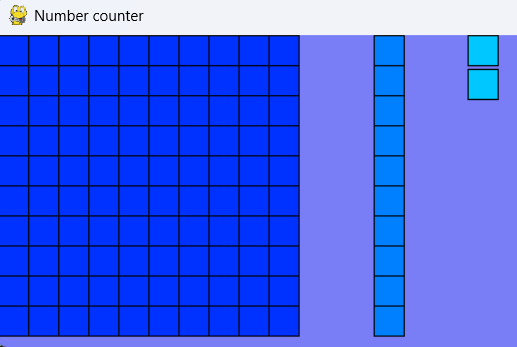

# Number Visualization with Pygame

This project explores number representation through a simple graphical interface built with **Pygame**.
It visualizes any number (up to 3 digits) by breaking it down into **hundreds**, **tens**, and **units**, and displaying them as colored blocks.

---

## 📸 Demo with number 112



---

## 🛠 Features

- Displays numbers graphically using colored blocks.
- Separates **hundreds**, **tens**, and **units** into different visual groups.
- Works with any number between `0` and `999`.
- Easy to modify or extend for other base systems or representations.

---

## 🚀 Getting Started

### 1️⃣ Requirements

Make sure you have **Python 3.x** and **Pygame** installed:

```bash
pip install pygame
```

### 2️⃣ Run the Program

Clone the repository and run the script:

```
git clone git@github.com:Dev9Shadow/Graphics-Numbers.git
```


---


## 🧩 How It Works

* **Hundreds** are drawn as a 10x10 grid of blocks.
* **Tens** are drawn as a vertical line of blocks, positioned after the hundreds grid.
* **Units** are drawn one by one, next to the tens.

You can test different numbers by changing this line in the code:

<pre class="overflow-visible!" data-start="1967" data-end="1998"><div class="contain-inline-size rounded-2xl relative bg-token-sidebar-surface-primary"><div class="sticky top-9"><div class="absolute end-0 bottom-0 flex h-9 items-center pe-2"><div class="bg-token-bg-elevated-secondary text-token-text-secondary flex items-center gap-4 rounded-sm px-2 font-sans text-xs"></div></div></div><div class="overflow-y-auto p-4" dir="ltr"><code class="whitespace-pre! language-python"><span><span>numeration(</span><span>"112"</span><span>)
</span></span></code></div></div></pre>

Try `"109"`, `"99"`, `"9"` etc. to see how the visualization adapts.

---

## 🤝 Contributing

Feel free to fork the project and improve it:

* Add support for numbers larger than 999.
* Customize colors and shapes.
* Add an input field to enter numbers dynamically.

Pull requests are welcome! 🎉
